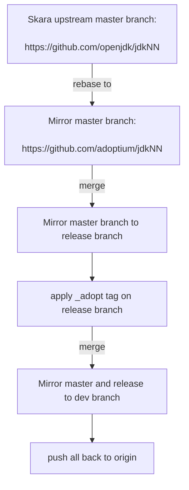

# OpenJDK Mirror Scripts

These scripts are run at https://ci.adoptopenjdk.net/view/git-mirrors/ and are responsible for updating the Eclipse Adoptium clones of the various OpenJDK Skara github repositories that we are interested in building.

## For developers

OpenJDK Source Control repositories are now managed using the GitHub (project Skara). The Git repositories are mirrored at OpenJDK.

Examples of converted repositories are available at https://github.com/openjdk/.

# Skara repos and processes

Historical information about the migration to OpenJDK GitHub from Mercurial is available at https://openjdk.org/jeps/369

**Note For Developers:** Any Adoptium Patches must be done on the "release" branch, they will be auto-merged nightly into "dev".

The script merges the appropriate latest merged "master" branch code into both "dev" and "release", it also ensures all the
"Adoptium Patches" from the "release" branch are merged into the "dev" branch.

The BRANCH environment variable defines the upstream master branch name, and defaults to "master" if not specified. The dev and release
mirror branches default to "dev" and "release" for "master", for other master branches they are "dev_$BRANCH" and "release_$BRANCH". This is to support
the new upstream OpenJDK head repository stabilization version branches (e.g., `jdk23`, would use mirror branches `dev_jdk23` and `release_jdk23`).

The flow for the merge process is:

# Release trigger scripts and process

- triggerReleasePipeline.sh runs by Jenkins job build-scripts/utils/releaseTrigger_jdkXXu and only run by scheduler "H * 10-25 1,3,4,7,9,10 *"
- It auto triggers job build-scripts/release-openjdkXX-pipeline, with execption on jdk8 arm32Linux. Release champion should check GA tag from "https://github.com/adoptium/aarch32-jdk8u" and manual build jdk8 arm32Linux by using release-openjdk8-pipeline
- It uses functions defined in common.sh and gets input from file releasePlan.cfg. Release champion should prepare to set the expected versions in releasePlan.cfg pre-release. It can also be used for e2e test when we manually create tag in adoptium mirror repo (example see comments in releasePlan.cfg)